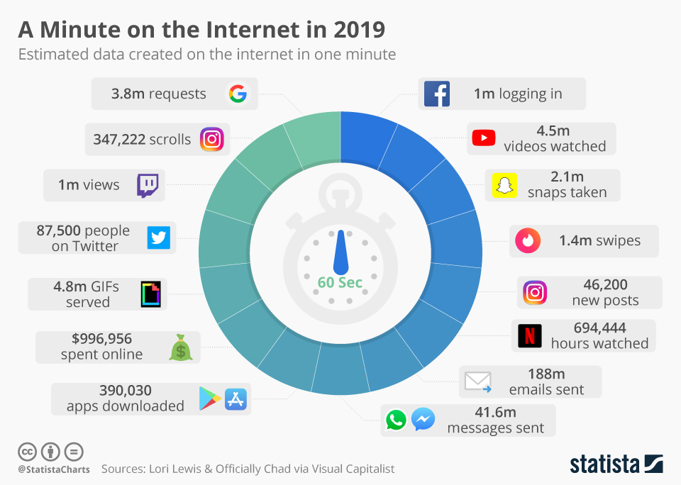
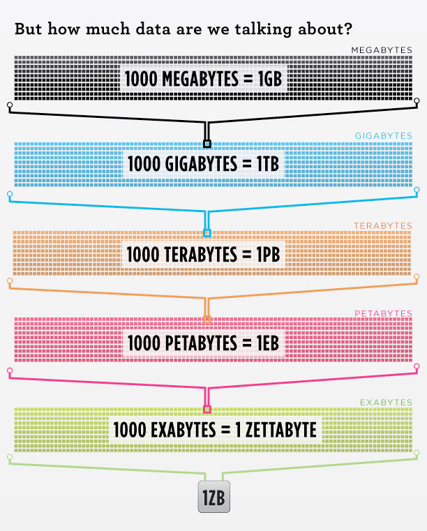
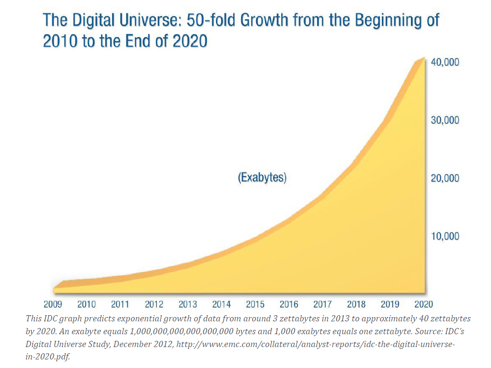
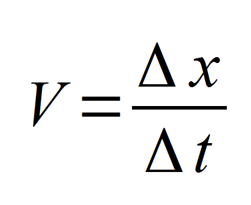
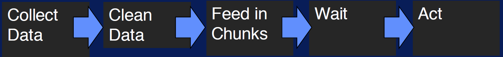
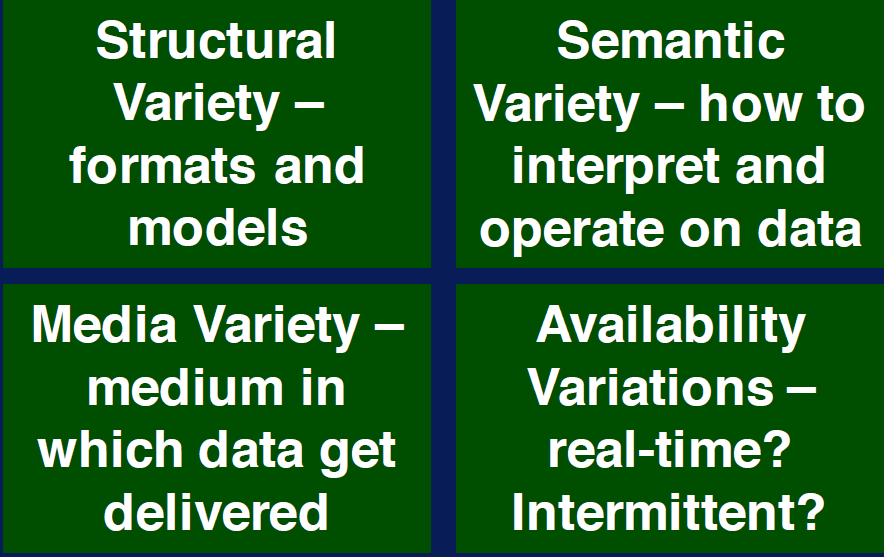
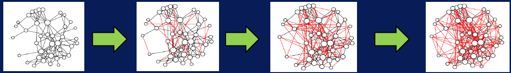
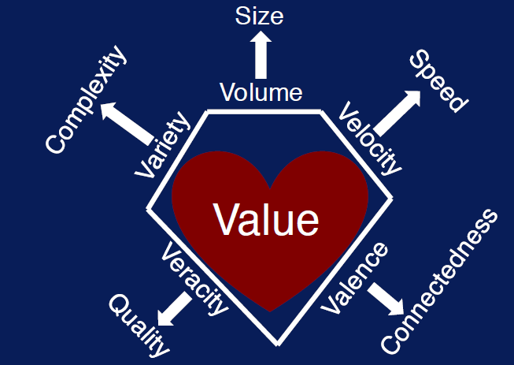

## Big Data characteristics

### Volume

- Volume = Size

1. Every Minute:
* 188 million  emails sent
* 1 million logging in Facebook
* 87.5 K people on twitter
* 3.8 Million requests on google

100 MBs ~= couple of volumes of Encyclopedias

A DVD ~= 5GB

LHC ~= 15 PBs a year

1 TB ~= 300 hours of good quality video

** Challenges ** : Storage

- Storing huge amount of data is very expensive

- Data acquisition and Retrival also very challenging

- Processing that data also challenging

- Processing high volume of data leads high cost and low performance.

### Velocity

Velocity == Speed

- Speed of creating data
- Speed of storing data
- Speed of analyzing data

_Big data leads to real-time action_

In business perspective: Late decisions means missing opportunities.

**Real time processing vs Batch processing:**
Real time processing will give us the result instantiatly by instantly capture streaming data, feed real time to machines, process real time and finally act.

Batch processing is comprises of collect data, clean data, feed in chunks, wait, and act so it takes time compared to real time processing.

Rate needed for data driven actions is Rate of generation and processing of data.

Streaming data + Streaming data -> Real-time processing

'what is going on right now ?' and 'gets generated at varied rates' brings real-time processing.

Real time processing helps to produce agile and adaptable business decisions.

### Variety

Variety == Complexity

* Data were confined only to tables but today data are more heterogeneous.

**Axes of Data Variety**

* Impacts of data variety:

    - Harder to ingest
    - Difficult to create common storage
    - Difficult compare and match data across variety platforms.
    - Difficult to integrate
    - Management and policy challenges

### Veracity

Veracity == Quality

- Accuracy of data
- Reliability of the data source
- Context witihn analysis

Uncertainty and provenance effects the reliability of the data source

### Valence

valence == Connectedness

* Data connectivity:
    - Two data items are connected when they are related to each other.
* Valence:
    - Fraction of data items that are connected out of total number of possible connections.

If valence increases over time makes the data connections denser.

Organizational Behavior:
    As density increases, coordination and communication between participants grows and the promotion of shared behaviors and behavioral expectations increases the chance of stakeholders forming coalitions.

### Value

[Go back](index.md)

